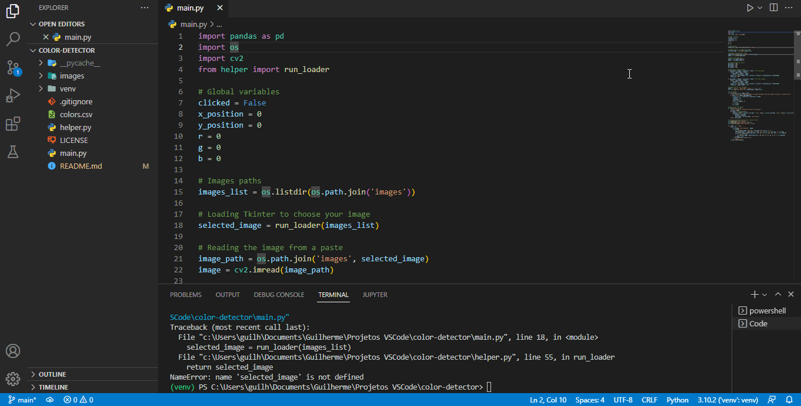

# **Color Detector**
With this script you will load an image and be able to detect the color of any pixels in it.
## **How it works:**
First of all you must load the images you want to use in ***/image*** paste. It can be ***.jpg*** or ***.png***.

After that you need to run the ***[main.py]*** file. It will open a **Tkinter** interface and you can choose any image that exists in ***/image*** paste.

When the selected image is loaded a **OpenCV** interface will be opened. When you ***double-click*** your left mouse button at any pixel, the color name will appears at the top of the screen. Furthermore, it will show the values of the RGB system.

The color name is searched in the ***[colors.csv]*** database. The script uses **Pandas** to approximate the pixel's RGB (obtained from **OpenCV**) with the color name.

> *Note 1: The script resizes the loaded image to fit to OpenCV window. An image with few pixels loaded in a big window will have quality problems. So it is recommended to load high resolution images. You can change the values of height and width according to your setup or preference.*

> *Note 2: To quit the application just press ***esc***.*

#### **Used tools**
``OpenCV``, ``Tkinter``, ``Pandas``

### **Author**
| [ Guilherme](https://github.com/guimfs) |
| :---: |
|  |

### **License**
The MIT License ([MIT])

Copyright (c) 2022 Guilherme Mansur Ferreira dos Santos

Permission is hereby granted, free of charge, to any person obtaining a copy
of this software and associated documentation files (the "Software"), to deal
in the Software without restriction, including without limitation the rights
to use, copy, modify, merge, publish, distribute, sublicense, and/or sell
copies of the Software, and to permit persons to whom the Software is
furnished to do so, subject to the following conditions:

The above copyright notice and this permission notice shall be included in all
copies or substantial portions of the Software.

[links]: <> (Links used in this README.md file)
[main.py]: https://github.com/guimfs/color-detector/blob/main/main.py
[colors.csv]: https://github.com/guimfs/color-detector/blob/main/colors.csv
[MIT]: https://choosealicense.com/licenses/mit/
